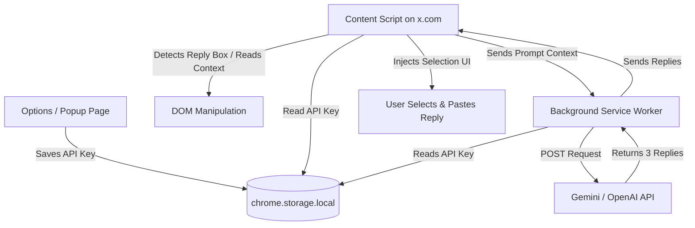

# Technical Specification: X (Twitter) AI Reply Chrome Extension

This document outlines the architecture, data flow, DOM manipulation strategies, and recommended technical implementation details for building a Chrome extension that automatically generates AI replies for X.com.

---

## 1. Extension Architecture

A Chrome Extension (Manifest V3) runs in isolated environments. Our extension consists of four main layers:



### Key Components:
1. **Manifest (`manifest.json`):** Declares configuration, permissions, content scripts, and the background service worker.
2. **Content Script (`content.js`):** Interacts directly with the x.com webpage. It detects text fields, injects buttons, and scrapes the target tweet content.
3. **Background Service Worker (`background.js`):** Performs network requests to AI providers securely (avoiding CORS issues and keeping key access centralized).
4. **Popup/Settings Page (`popup.html`/`popup.js`):** A small UI that appears when clicking the extension icon in the toolbar, letting the user configure their API key and preferred tone/style settings.

---

## 2. In-Depth Technical Details

### A. Manifest V3 Configuration
Manifest V3 is required for modern Chrome extensions. Key permissions needed:
- `storage`: To save the user's API Key and tone settings.
- `activeTab` or host permissions for `https://*.x.com/*` and `https://*.twitter.com/*` so the content script can run on X.

```json
{
  "manifest_version": 3,
  "name": "X AI Reply Assistant",
  "version": "1.0.0",
  "permissions": ["storage"],
  "host_permissions": [
    "https://*.x.com/*",
    "https://*.twitter.com/*"
  ],
  "background": {
    "service_worker": "background.js",
    "type": "module"
  },
  "content_scripts": [
    {
      "matches": ["https://*.x.com/*", "https://*.twitter.com/*"],
      "js": ["content.js"],
      "css": ["content.css"],
      "run_at": "document_end"
    }
  ],
  "action": {
    "default_popup": "popup.html"
  }
}
```

---

### B. Injected UI & Shadow DOM
X updates its styles and layout frequently. Injecting generic HTML elements directly into X's main DOM can result in style clashes (e.g., X's CSS overriding our button colors, or our CSS breaking the layout of X's reply toolbar).

**Solution:** Injected elements (the AI Reply button and the reply option picker dropdown) must be wrapped inside a **Shadow DOM**.
1. Create a host container element: `const host = document.createElement('div');`
2. Attach a shadow root: `const shadowRoot = host.attachShadow({ mode: 'closed' });`
3. Inject the CSS styles and elements into the `shadowRoot`. Only the extension can inspect and style this container, maintaining design integrity.

---

### C. Detecting X's Dynamic Reply Box
X is a Single Page Application (SPA) built with React. Elements are constantly mounted and unmounted as the user scrolls or navigates.
- Use a `MutationObserver` on the `document.body` to listen for additions to the DOM.
- Specifically query for reply boxes. The reply box wrapper generally has an attribute or class structure resembling the reply toolbar.
  * Target element example: `div[data-testid="toolBar"]` (the action strip containing the media, GIF, and emoji icons).
- Once the toolbar is detected, inject the AI button next to the emoji button.

---

### D. Reading Tweet Context
To make the replies relevant, the content script needs to extract the text of the tweet the user is looking at.
- In a detail view (e.g., `/user/status/123`): Find the primary tweet element on the page (typically using `article[data-testid="tweet"]` closest to the reply editor).
- Extract the text content from the text wrapper inside that article (usually a `div[data-testid="tweetText"]`).
- Send this text to the background worker to use as context for prompt generation.

---

### E. AI Prompts & Reply Options
The background script sends a structured system instruction to the LLM (like Gemini Nano, Gemini 1.5 Flash, or GPT-4o-mini).

**Prompt Structure:**
> "You are an assistant generating replies for X (Twitter). Read the following tweet and generate exactly 3 distinct reply options. The replies should sound natural, conversational, and fit within 280 characters.
> 
> Tweet Context:
> {TWEET_TEXT}
> 
> Response format: A JSON array of 3 strings."

---

### F. Updating X's Draft.js Editor (Crucial Challenge)
Because X uses React and Draft.js (a rich-text framework), you cannot simply set `.value` or `.innerText` on the edit box. If you do, React's internal state will remain empty, and clicking "Post" will result in a blank post or error.

To successfully insert the text:
1. Target the contenteditable element (usually `div[role="textbox"]` or `div.public-DraftEditor-content`).
2. Focus the element: `editor.focus();`
3. Programmatically execute a paste command or dispatch input events:
   ```javascript
   // Method 1: Using document.execCommand (deprecated but widely functional for Draft.js insertions)
   document.execCommand('insertText', false, selectedReplyText);

   // Method 2: Dispatching clipboard data events (fallback if execCommand is restricted)
   const dt = new DataTransfer();
   dt.setData('text/plain', selectedReplyText);
   const pasteEvent = new ClipboardEvent('paste', {
     clipboardData: dt,
     bubbles: true,
     cancelable: true
   });
   editor.dispatchEvent(pasteEvent);
   ```

---

## 3. Recommended Development Stack
* **Vite** with **TypeScript** & **CRXJS Vite Plugin** for fast builds, automatic manifest creation, type safety, and real-time Chrome hot reloading.
* **Tailwind CSS** (configured to build only inside the Shadow DOM wrapper) for quick styling of the options popup and injected reply card components.
